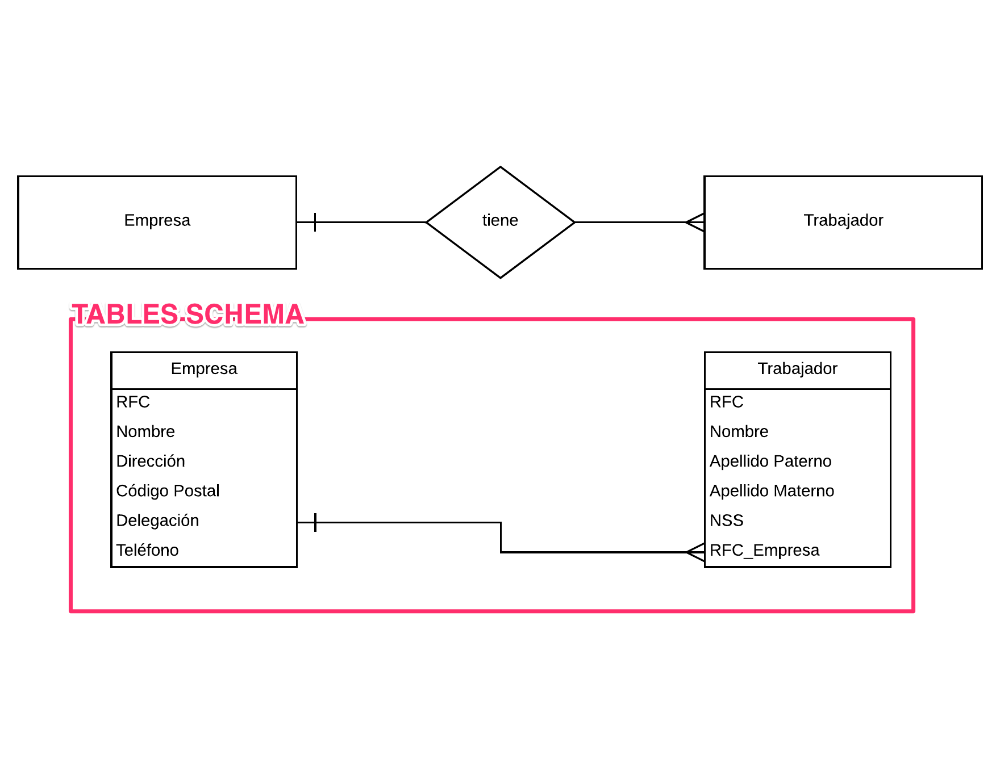
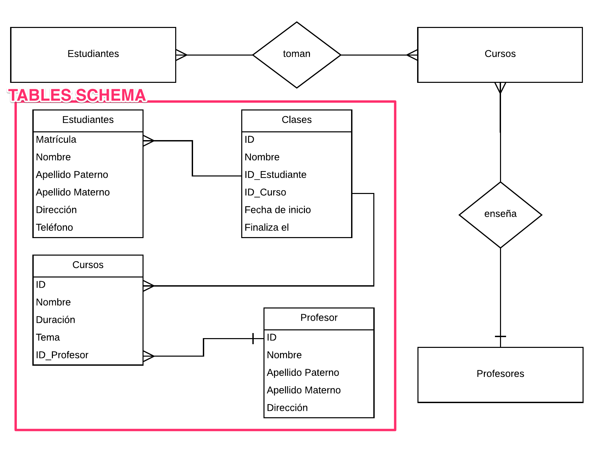

# Intro to MySQL

## The Assignment

You are the company's Database Administrator (DBA), and you have been asked to implement the database schema based on two entity-relation diagrams (ERDs).

To complete the exercises, you will need to create:

  - A new database
  - The tables shown in the ERD's
  - The tables' columns
  - The foreign keys that connect the tables


## Deliverables

A mysql database `DBA_{your-github-username}` on the 45.55.135.14 remote server with the tables shown below.

## Setup Instructions

1. Connect to Remote Server through SSH (SSH password will be provided in the Slack Channel)

  ```
  ➜  ~ ssh root@45.55.135.14
  root@45.55.135.14's password:
  ```

2. While inside remote server, log into mysql shell as root user + enter password
   (DB password will be provided in Slack Channel)

  ```
  mysql -u root -p
  ```

3. From the mysql shell, create the database _with your Github username_. (**Example**)

  ```sql
  mysql> CREATE DATABASE DBA_tphdev;  # for student Travis Patterrson Hubbard, you need to create your own
  ```

4. From the mysql shell, enter the database

  ```sql
  mysql> USE DATABASE DBA_tphdev;   
  ```

## Exercises

Create the tables, columns, and relations from the two ERDs below

#### ERD Exercise 1 : Empresa - Trabajador
  

#### ERD Exercise 2 : Profesor - Estudiante - Curso
  
