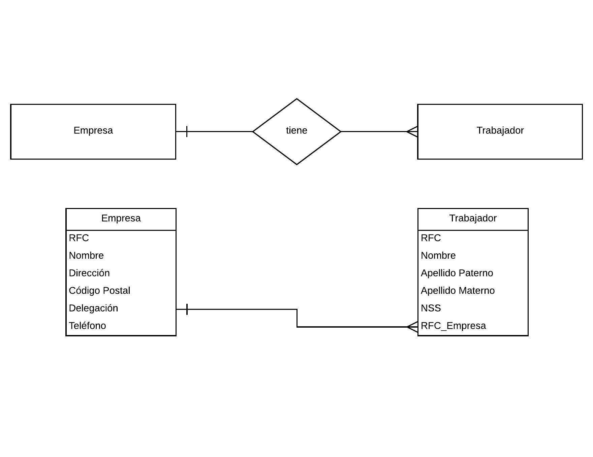
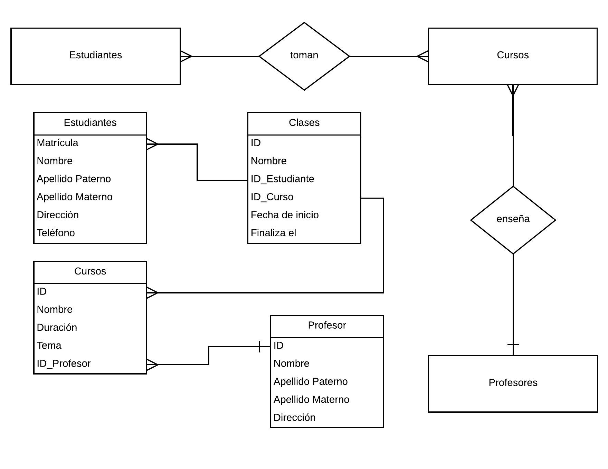

# Intro to MySQL

## The Assignment

You are the only DBA in the company right now and you have been assigned a task: You need to create the correct code for these two Entity-Relation Diagram. Keep in mind that maybe you need to code also the relations amongst tables.

## Deliverables

  + a github repository named `assignment-intro-to-mysql`

## Setup Instructions

  1. Connect to MySQL Server on [45.55.135.14/phpmyadmin](45.55.135.14/phpmyadmin)
  2. Create a database and add your initial letters as suffix.

  ###### Example
  
  ```sql
  CREATE DATABASE DBA_BG; # Bill Gates
  ```

## Exercise

  ##### Exercise 1.
  

  ##### Exercise 2.
  
